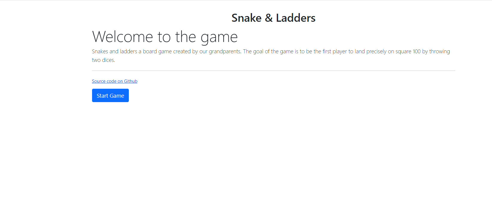
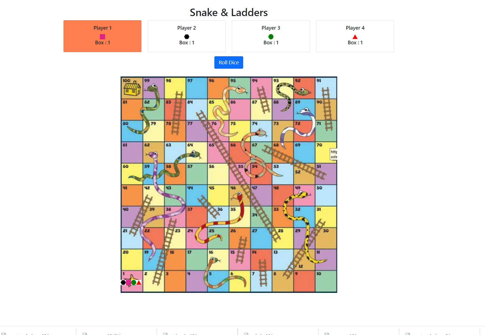

Stack :  Angular + Java + SpringBoot + (I implemented H2 Db and Mysql first, but didnt use it because I held the session in ConcurrentHashMap. )

### For backend ### 
(1)Import project  
(2)Configure and enable Lombok : https://www.baeldung.com/lombok-ide  
(3)Clean and build maven project by running :  
  mvn clean install

### For frontend ### 
Run the following command
npm install 
npm run start  

Api test: PlayControllerApiTest   
Api doc : http://localhost:8080/swagger-ui/#/  
FrontEnd Url: http://localhost:4200/  

HomePage

GamePage

